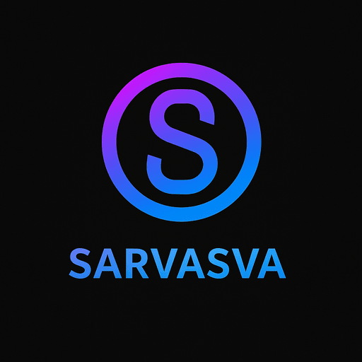

# 🔥 Sarvasva Fitness

<div align="center">
  
  
  **Transform Your Body, Transform Your Life**
  
  [](https://sarvasva-fitness.vercel.app)
  [](https://github.com/sarvast/Sarvasva-v69)
  [](https://sarvasva-fitness.vercel.app)
  
  *A comprehensive fitness tracking PWA with Snapchat-style streaks and fully customizable workout plans*
</div>

---

## ✨ Features

### 🔥 **Streak System** (NEW!)
- **Snapchat-style streak counter** with fire icon 🔥
- Maintains streak only when ALL 3 conditions are met daily:
  - ✅ Steps goal achieved
  - ✅ Workout completed
  - ✅ Calories under TDEE (diet on track)
- **Motivational messages** based on streak length
- **Fear of losing streak** = Daily motivation to stay consistent!

### 🏠 **Smart Dashboard**
- Personalized greeting based on time of day
- Real-time metrics: BMR, TDEE, BMI
- Dynamic transformation timeline (adjusts based on performance)
- Quick-add buttons for steps and water
- Auto step tracking with device motion sensors
- Calorie deficit/surplus tracking

### 💪 **Custom Workouts**
- **Fully customizable exercise plans** for each day of the week
- **Animated GIF demonstrations** for every exercise
- Todo-style completion tracking
- Swipeable exercise cards with navigation
- Default workout schedule included:
  - Monday: Chest & Shoulders
  - Tuesday: Back
  - Wednesday: Arms
  - Thursday: Abs & Core
  - Friday: Legs
  - Saturday: Active Recovery
  - Sunday: Rest

### 🍽️ **Nutrition Tracker**
- Indian food database with calorie tracking
- Add custom food items
- Real-time calorie deficit calculations
- BMR-based daily calorie recommendations
- Track calories eaten vs burned

### 🎯 **Goal System**
- Dynamic weight loss timeline with performance-based adjustments
- Visual progress bars for all metrics
- Target weight tracking
- BMI monitoring
- Weekly projection updates

### 📱 **PWA Features**
- **Works offline** after first load
- Install as native app on mobile/desktop
- Push notifications support
- **Offline indicator** (red banner when no internet)
- Exercise GIFs cached for offline viewing
- App-like experience with smooth animations

### 🔔 **Smart Tracking**
- Auto step tracking using device motion sensors
- Manual step entry options
- Water intake tracking (250ml, 500ml quick-add)
- Workout completion toggle
- Daily log persistence with IndexedDB

---

## 🚀 Quick Start

```bash
# Clone the repository
git clone https://github.com/sarvast/Sarvasva-v69.git
cd Sarvasva-v69

# Install dependencies
npm install

# Start development server
npm run dev

# Build for production
npm run build
```

---

## 🛠️ Tech Stack

- **Frontend:** React 18 + TypeScript + Vite
- **Styling:** Tailwind CSS with Glass Morphism UI
- **Database:** IndexedDB (via idb) for offline storage
- **PWA:** Vite PWA Plugin + Service Worker
- **Routing:** React Router v6
- **Icons:** Lucide React
- **Date Handling:** date-fns
- **Deployment:** Vercel with auto-deploy

---

## 📱 PWA Installation

### Mobile (Android/iOS)
1. Visit [sarvasva-fitness.vercel.app](https://sarvasva-fitness.vercel.app)
2. Tap browser menu (⋮ or share icon)
3. Select "Add to Home Screen"
4. Enjoy native app experience!

### Desktop (Chrome/Edge)
1. Visit the app
2. Click install icon in address bar
3. Click "Install"

### Features After Installation
- ✅ Works offline
- ✅ Push notifications
- ✅ Native app feel
- ✅ No browser UI
- ✅ Fast loading

---

## 🎨 Key Highlights

- **🎯 Personalized:** Complete onboarding with BMR/TDEE calculations
- **📊 Real-time:** Dynamic timeline adjustments based on daily performance
- **🔥 Motivational:** Streak system creates fear of losing progress
- **📱 Mobile-First:** Glass morphism UI optimized for touch
- **⚡ Fast:** Vite build with optimized bundle (121KB gzipped)
- **🌐 Offline:** Full functionality without internet connection
- **🎬 Visual:** Animated GIF demonstrations for all exercises

---

## 📊 How It Works

### Streak Calculation
Your streak increases by 1 each day when you complete:
1. **Steps Goal** - Hit your daily step target
2. **Workout** - Complete at least one exercise
3. **Diet** - Stay at or below your TDEE

Miss any one condition? Streak resets to 0! 😱

### Timeline Adjustments
- **High calorie deficit** → Timeline decreases (faster results)
- **Missed workout** → Timeline increases by 0.2 weeks
- **Low steps** → Timeline increases by 0.1 weeks

---

## 🏗️ Project Structure

```
Sarvasva-v69/
├── src/
│   ├── components/       # Reusable UI components
│   │   ├── ui/          # Base components (Button, Card, etc.)
│   │   ├── StreakCard.tsx
│   │   └── InstallPrompt.tsx
│   ├── pages/           # Route pages
│   │   ├── Dashboard.tsx
│   │   ├── Fitness.tsx
│   │   ├── Nutrition.tsx
│   │   ├── Goals.tsx
│   │   └── Settings.tsx
│   ├── context/         # React Context
│   │   └── SarvasvaContext.tsx
│   ├── lib/             # Utilities & logic
│   │   ├── db.ts        # IndexedDB operations
│   │   ├── constants.ts # BMR/TDEE calculations
│   │   ├── streak.ts    # Streak logic
│   │   └── workout-data.ts # Exercise database
│   ├── hooks/           # Custom React hooks
│   └── App.tsx          # Main app component
├── public/              # Static assets
└── vite.config.ts       # Vite + PWA config
```

---

## 🤝 Contributing

Contributions are welcome! 

1. Fork the repository
2. Create your feature branch (`git checkout -b feature/AmazingFeature`)
3. Commit your changes (`git commit -m 'Add some AmazingFeature'`)
4. Push to the branch (`git push origin feature/AmazingFeature`)
5. Open a Pull Request

---

## 📄 License

MIT License - see [LICENSE](LICENSE) for details

---

## 👨‍💻 Author

**Sarthak Srivastava**  
🔗 [GitHub](https://github.com/sarvast) | 🌐 [Live Demo](https://sarvasva-fitness.vercel.app)

---

## 🙏 Acknowledgments

- Exercise GIFs from GymVisual, Giphy, and Tenor
- Icons by Lucide React
- UI inspiration from modern fitness apps

---

<div align="center">
  <strong>Built with 💪 for the ultimate transformation journey</strong>
  <br>
  <em>No excuses, only results. Keep that streak alive! 🔥</em>
</div>
